# SpaceBashers

Space Invaders, reimagined for the terminal by someone who probably should have stopped three features ago but didn't. No dependencies. No frameworks. No excuses.


### [>>> PLAY IN YOUR BROWSER (1-4 Players) <<<](https://0xdingo.github.io/spacebashers/)

---

## Table of Contents

- [Three Ways to Play](#three-ways-to-play)
- [Browser Edition](#browser-edition)
- [Terminal Classic](#terminal-classic)
- [Network Multiplayer](#network-multiplayer)
- [System Architecture](#system-architecture)
- [The Sound Engine](#the-sound-engine)
- [Network Protocol](#network-protocol)
- [Game Mechanics Deep Dive](#game-mechanics-deep-dive)
- [The Commit Log](#the-commit-log)

---

## Three Ways to Play

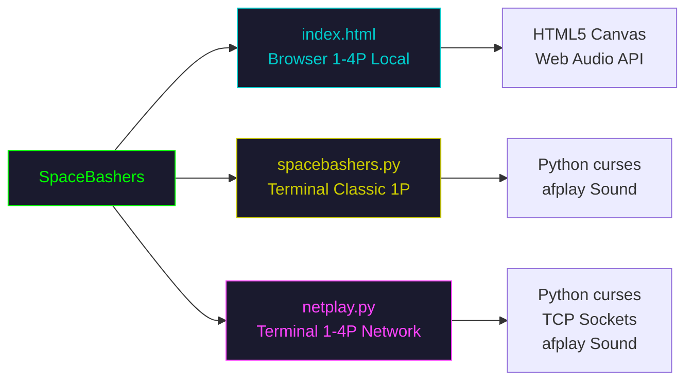

| Mode | File | Players | Requires |
|---|---|---|---|
| Browser | `index.html` | 1-4 local | Any modern browser |
| Terminal Classic | `spacebashers.py` | 1 | Python 3.6+, terminal with curses |
| Network Multiplayer | `netplay.py` | 1-4 over LAN | Python 3.6+, terminal with curses |

---

## Browser Edition

Open `index.html` or visit [0xdingo.github.io/spacebashers](https://0xdingo.github.io/spacebashers/).

1-4 players crowd around one keyboard. Invaders rain down in waves. Everybody shoots. Most kills wins.

### Controls

| Player | Move | Fire |
|---|---|---|
| P1 (green) | `A` / `D` | `W` |
| P2 (cyan) | `←` / `→` | `↑` |
| P3 (orange) | `J` / `L` | `I` |
| P4 (magenta) | Numpad `4` / `6` | Numpad `8` |

`M` toggles sound. Select 1-4 players on the setup screen.

### Game Flow

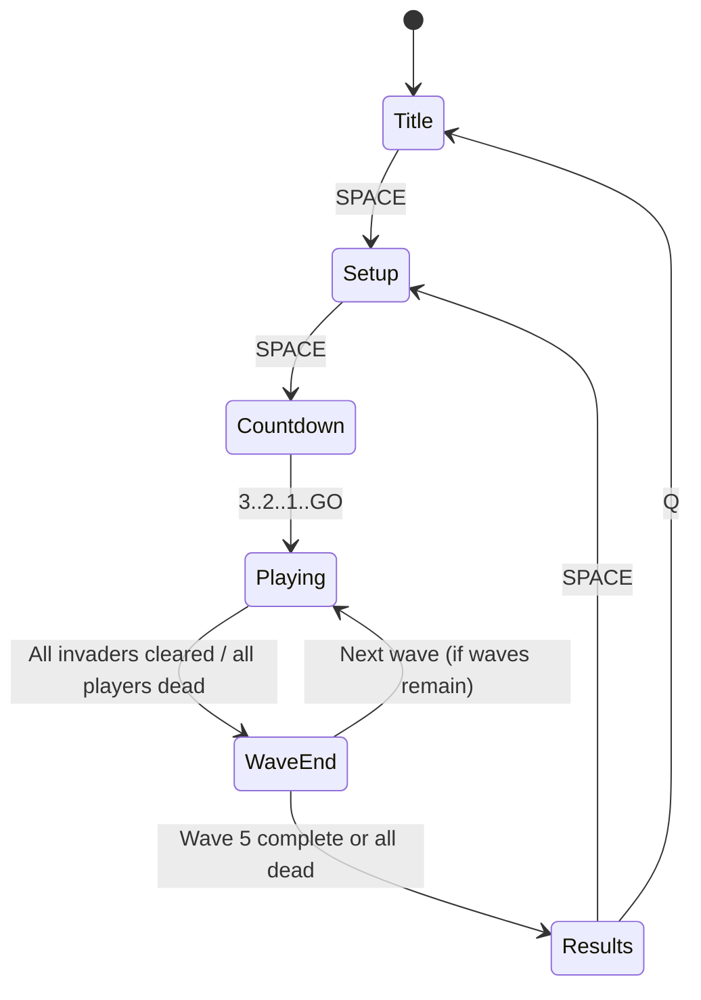

### Powerups

Killed invaders have a 12% chance to drop a powerup. Powerups fall toward the bottom and are collected on contact.

| Drop | Char | Color | Effect | Duration |
|---|---|---|---|---|
| Heal | `+` | green | Restore 3 HP | Instant |
| Double | `x` | yellow | 2x points per kill | 6 seconds |
| Rapid | `!` | red | Fire cooldown drops from 150ms to 60ms | 6 seconds |
| Steal | `*` | magenta | Each kill steals 3% of the richest opponent's score | 6 seconds |

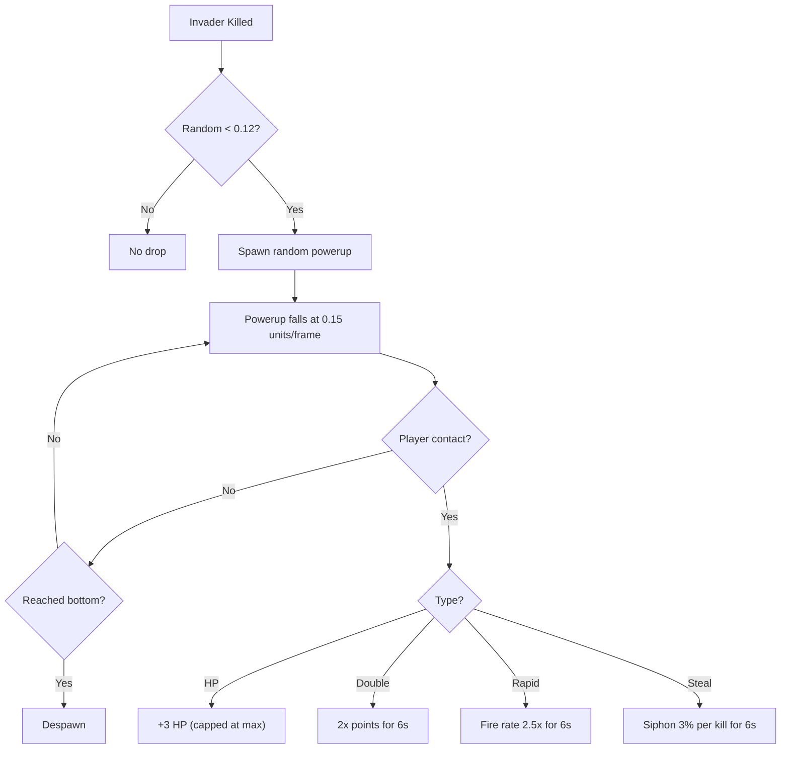

---

## Terminal Classic

```bash
python3 spacebashers.py
```

The original. Where it all began. A love letter to 1978 rendered in Unicode box-drawing characters and hubris.

| Key | Action |
|---|---|
| `←` `→` or `A` `D` | Move ship |
| `Space` | Fire (hold to rapid-fire) |
| `P` | Pause |
| `M` | Toggle sound |
| `Q` | Quit |

### How Classic Mode Works

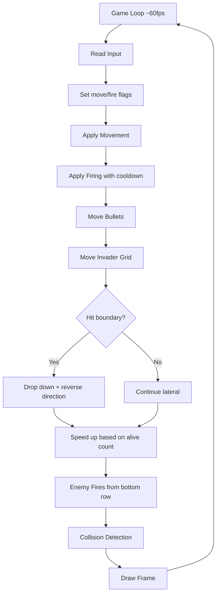

**Features:**
- 5 rows of invaders with different sprites and point values (10/20/30 pts)
- Mystery ship flyovers for bonus points (50-300 pts)
- 4 destructible barriers with arch cutouts
- HP system with color-coded health bar (10 HP, 3 damage per hit, survives 3 hits)
- Invaders accelerate as their numbers thin: `speed = max(0.05, 0.5 * alive/total)`
- Procedurally generated retro sound effects via macOS `afplay`
- Level progression: each cleared wave increases invader speed and enemy fire rate

### Invader Grid Layout

```
Row 0:  (@@) (@@) (@@) (@@) (@@) (@@) (@@) (@@)   30 pts  white
Row 1:  <**> <**> <**> <**> <**> <**> <**> <**>   20 pts  cyan
Row 2:  <**> <**> <**> <**> <**> <**> <**> <**>   20 pts  cyan
Row 3:  /\/\ /\/\ /\/\ /\/\ /\/\ /\/\ /\/\ /\/\   10 pts  yellow
Row 4:  /\/\ /\/\ /\/\ /\/\ /\/\ /\/\ /\/\ /\/\   10 pts  yellow

                    ####    ####    ####    ####          barriers
                    ####    ####    ####    ####
                    ##  ##  ##  ##  ##  ##  ##  ##

                         /^\                              you
```

---

## Network Multiplayer

Same hungry hungry hippos gameplay as the browser edition, but over the network via TCP. Pure Python stdlib. Zero dependencies. We implemented a custom client-server architecture with authoritative host simulation, state snapshot broadcasting, and buffered stream parsing for a game about shooting ASCII aliens in a terminal. We regret nothing.

### Quick Start

**Host a game (also plays as P1):**
```bash
python3 netplay.py host [--port 7777]
```
Displays your LAN IP on startup. Press SPACE to start -- works solo or with up to 3 others.

**Join a game:**
```bash
python3 netplay.py join 192.168.1.X [--port 7777] [--name YourName]
```

### Controls

All players use the same keys: `A`/`D` to move, `W` or `↑` to fire. `M` toggles sound. `Q` quits.

Host presses `SPACE` to start rounds and can start solo or wait for players to join.

### Network Game Flow

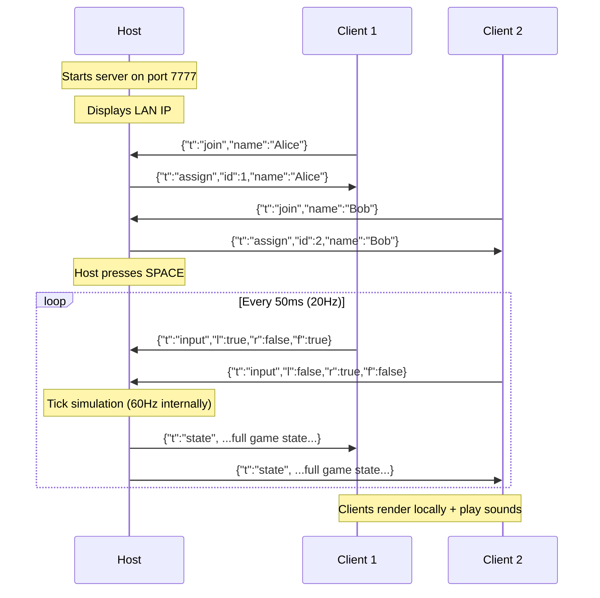

---

## System Architecture

Three files. Three runtimes. One shared vision of what a terminal game can be if you refuse to acknowledge scope creep as a concept.

### Overall Component Map

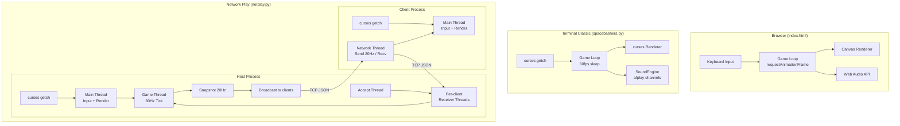

### Host Threading Model

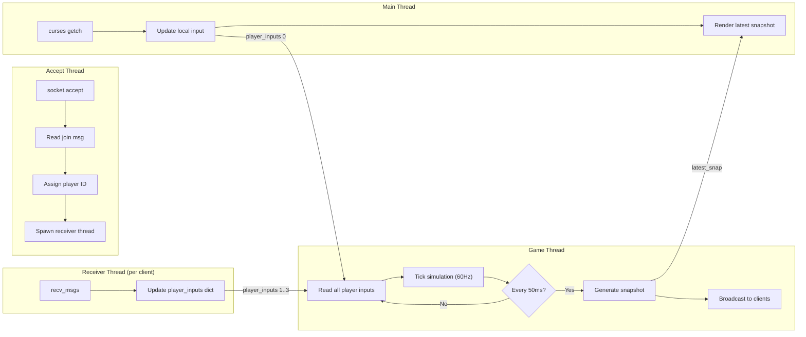

### Client Threading Model

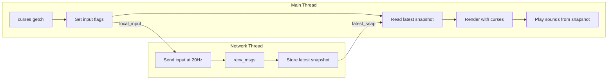

---

## The Sound Engine

Both `spacebashers.py` and `netplay.py` include an identical `SoundEngine` class that generates every sound effect from pure math at startup. No audio files. No WAV assets. No CDN. Just sine waves, noise, and an unreasonable amount of confidence that this would work. It did.

The browser version achieves the same thing with Web Audio API oscillators, because we don't half-commit to anything around here.

### How Terminal Sounds Work

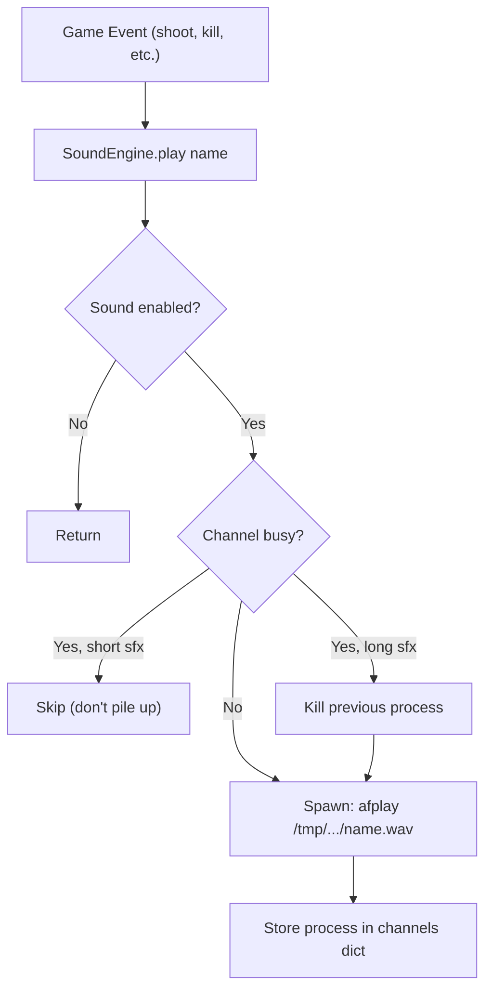

### WAV Generation Pipeline

All sounds are generated at startup from math -- no audio files ship with the game.

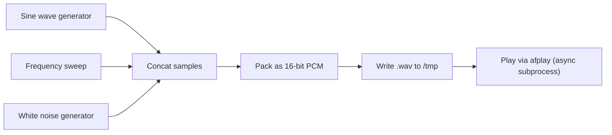

### Sound Catalog

| Sound | Waveform | Frequency | Duration | Trigger |
|---|---|---|---|---|
| `shoot` | Sine decay | 880Hz → 440Hz | 120ms | Player fires |
| `kill` / `invader_kill` | Square + noise | 600Hz → 300Hz + burst | 160ms | Invader destroyed |
| `player_hit` | Noise + sine | White + 100Hz | 300ms | Player takes damage |
| `mystery` | FM sine | 200Hz wobble ±100Hz | 400ms | Mystery ship appears |
| `mystery_hit` | Square arpeggio | C5→E5→G5→C6 | 390ms | Mystery ship destroyed |
| `march` | Square | 80Hz → 60Hz | 100ms | Invader grid steps |
| `game_over` | Square descend | A4→F#4→E4→C4 | 1000ms | All HP gone |
| `level_up` / `round_end` | Square ascend | C5→E5→G5→C6 | 600ms | Wave cleared |
| `bonus_drop` | Sine | 1200Hz | 80ms | Powerup spawns |
| `bonus_grab` | Square arpeggio | C5→G5→C6 | 180ms | Powerup collected |
| `steal` | Sawtooth | 200Hz → 150Hz | 200ms | Score stolen |
| `countdown` | Square | 440Hz | 150ms | 3.. 2.. 1.. |
| `countdown_go` | Square | 880Hz | 300ms | GO! |

### Channel System (Process Management)

The naive approach spawned an `afplay` process per sound and the laptop achieved escape velocity after 60 seconds. The channel system -- born at 3 AM from the ashes of Tomas's rage-quit -- is arguably the most elegant process pool ever designed for a game that runs in a terminal. We're not saying it's production-grade. We're saying production should aspire to this.

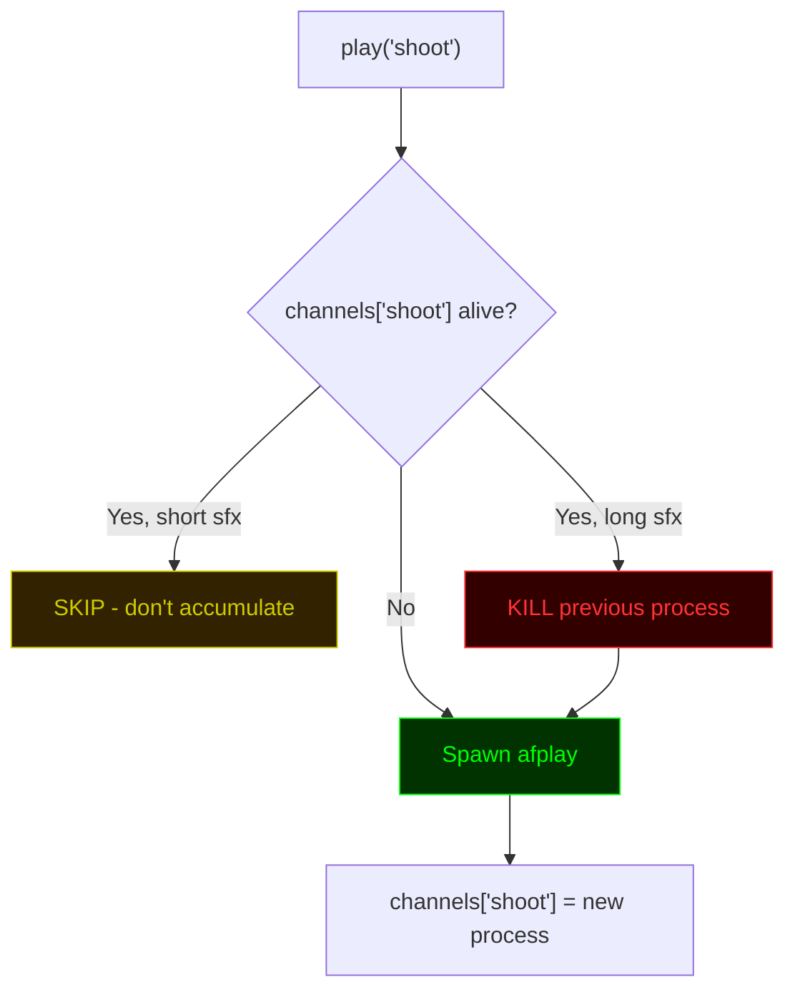

**Max concurrent processes: 8** (one per sound name). Short sounds like `shoot` and `kill` simply skip if their channel is busy, which naturally rate-limits them. Longer sounds kill the previous instance.

---

## Network Protocol

Yes, we wrote a custom network protocol for a terminal game. Yes, it was necessary. No, we will not be using WebSockets like normal people.

### Wire Format

Newline-delimited JSON over TCP. Every message is a single JSON object followed by `\n`. Simple, debuggable, and you can literally `nc` into a game server and watch the state fly by in your terminal. Not that we've done that. Okay, we've done that.

```
{"t":"input","l":true,"r":false,"f":true}\n
{"t":"state","st":"playing","wave":2,...}\n
```

Nagle's algorithm is disabled (`TCP_NODELAY`) for low latency.

### Message Types

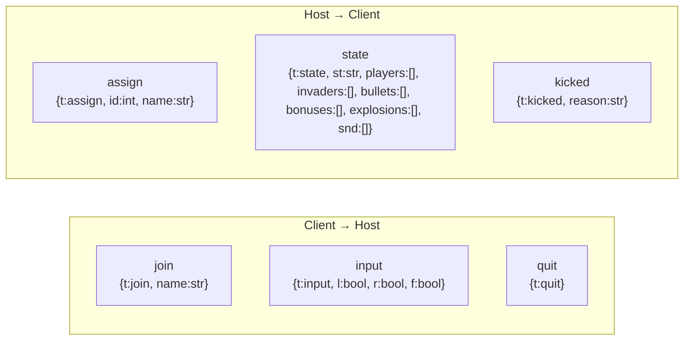

### State Snapshot Structure

The `state` message is the heart of the protocol. Broadcast at 20Hz, it contains the entire renderable game state:

```json
{
  "t": "state",
  "st": "playing",
  "wave": 3,
  "tw": 5,
  "players": [
    {
      "id": 0, "name": "Host", "color": "green",
      "ship": " /^\\ ",
      "x": 40.0, "y": 37,
      "hp": 7, "mhp": 10,
      "score": 1250, "kills": 23,
      "alive": true,
      "pw": "rapid", "combo": 4,
      "last_kill": 1234.5
    }
  ],
  "invaders": [
    {"x": 30.5, "y": 12.3, "sp": "(@@)", "hp": 1, "mhp": 2, "color": "cyan"}
  ],
  "bullets": [
    {"x": 42, "y": 20.5, "owner": 0, "color": "green"}
  ],
  "bonuses": [
    {"x": 25, "y": 18.2, "char": "+", "color": "green"}
  ],
  "explosions": [
    {"x": 30, "y": 12, "f": 2, "color": "green"}
  ],
  "snd": ["kill", "shoot"],
  "cn": 0
}
```

The `snd` array contains sound effect names that fired since the last snapshot. Clients play these locally so audio stays in sync without separate sound messages.

### Connection Lifecycle

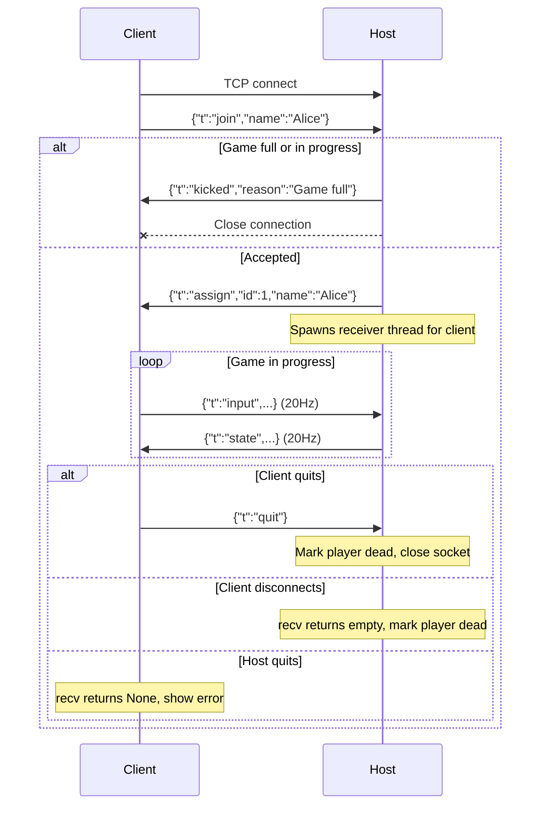

### Buffered Receive Protocol

TCP is a stream protocol. Messages may arrive fragmented or concatenated. Most people learn this the hard way in production at 2 AM. We learned it the hard way in a terminal game at 2 AM, which is arguably worse. The `recv_msgs` function handles this correctly on the first try (it was not the first try):

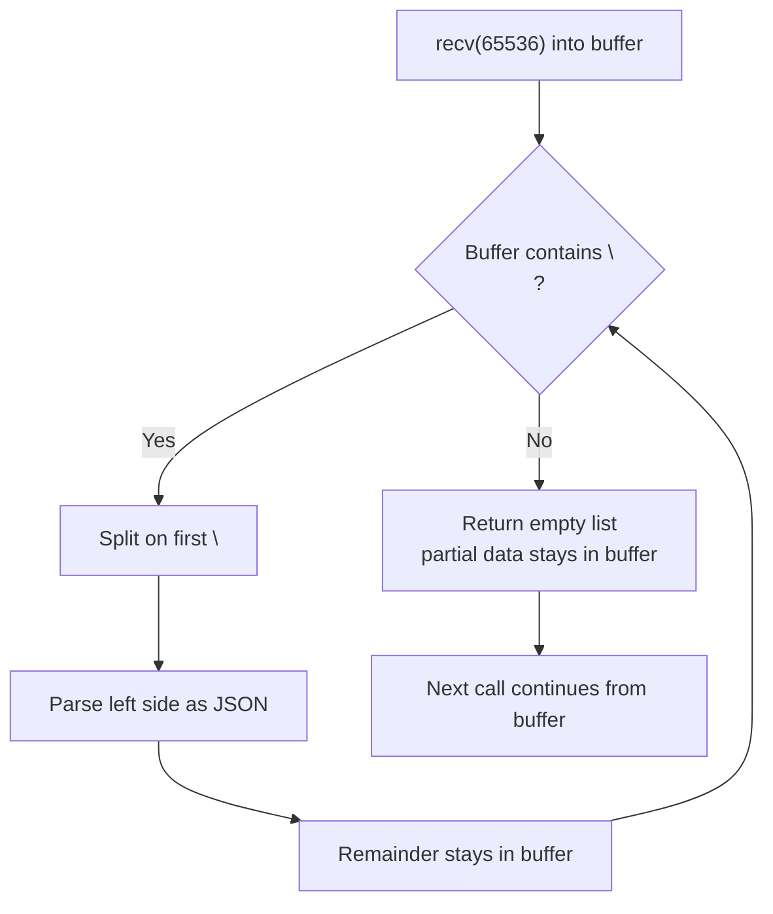

This ensures no data loss even when TCP delivers partial messages or multiple messages in a single `recv`.

---

## Game Mechanics Deep Dive

Every number in this section was the result of extensive playtesting, heated debate, and at least one broken engagement. The tuning is tight. Trust the tuning.

### Scoring System

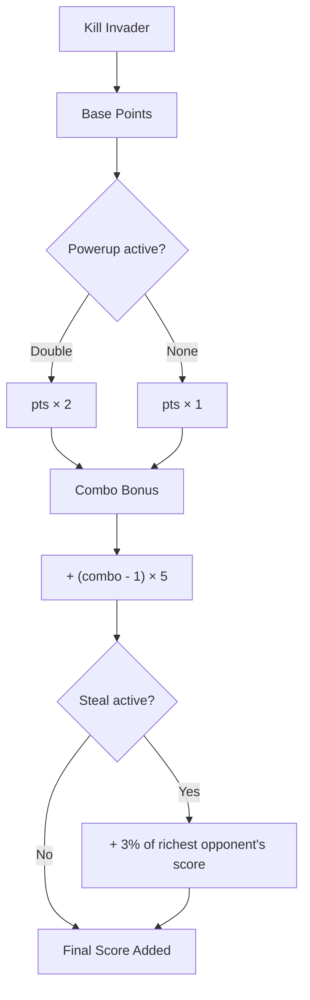

### Combo System

Kills within 1.5 seconds of each other build a combo chain.

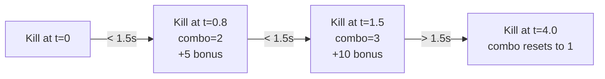

Max combo: 10x (+45 bonus per kill).

### Wave Scaling

Each wave spawns more invaders that are harder to kill.

| Wave | Invaders | Spawn Interval | Invader HP | Base Speed |
|---|---|---|---|---|
| 1 | 23 | 0.54s | 1 | 0.025 |
| 2 | 31 | 0.48s | 1 | 0.030 |
| 3 | 39 | 0.42s | 2 | 0.035 |
| 4 | 47 | 0.36s | 2 | 0.040 |
| 5 | 55 | 0.30s | 2 | 0.045 |

Formula:
- Invaders per wave: `15 + wave × 8`
- Spawn interval: `max(0.15, 0.6 - wave × 0.06)` seconds
- Invader HP: `1 + floor(wave / 3)`
- Base fall speed: `0.02 + wave × 0.005` units/tick

### Invader Movement

Unlike classic mode's rigid grid, multiplayer invaders fall independently with sinusoidal wobble:

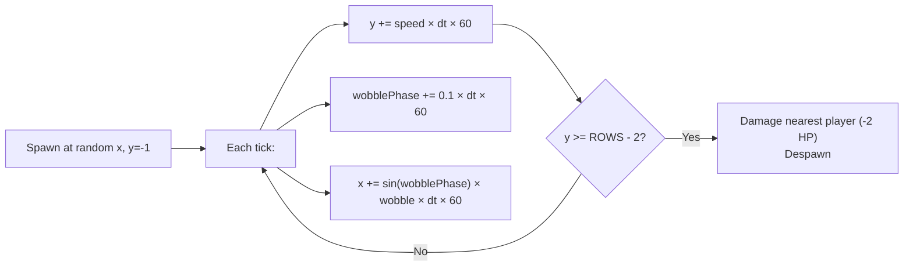

### HP and Damage

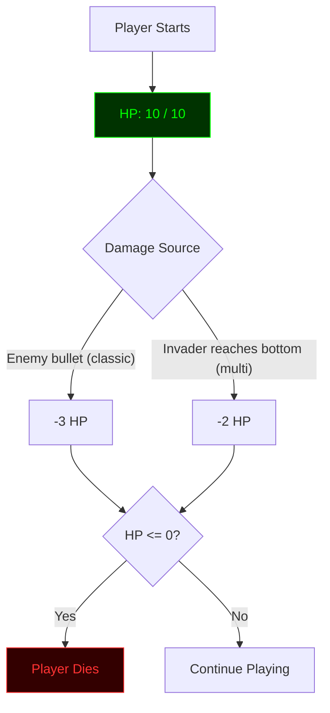

HP bar color thresholds: green (>6), yellow (>3), red (<=3).

### Classic Mode Invader Speed

The invader grid accelerates as aliens are destroyed:

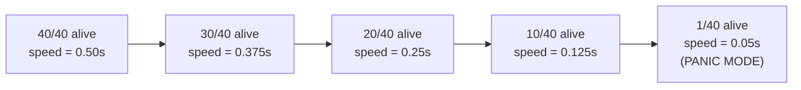

Formula: `speed = max(0.05, 0.5 × alive/total)` seconds between grid steps.

---

## Requirements

| Component | Requirement |
|---|---|
| Browser | Any modern browser (Chrome, Firefox, Safari, Edge) |
| Terminal | Python 3.6+, terminal with curses support |
| Sound (terminal) | macOS with `afplay` (game runs silently elsewhere) |
| Network | LAN connectivity, TCP port 7777 (configurable) |

---

## Commit Log

What follows is the unabridged development history of SpaceBashers, reconstructed from git, Jira, Slack archives, two restraining orders, and one therapist's notes (shared with written consent).

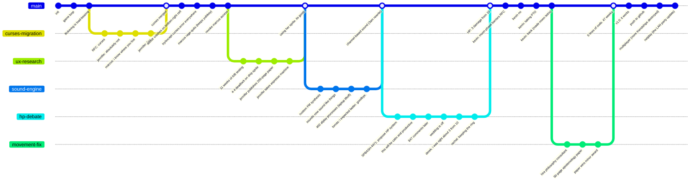

```
commit a1b2c3d
Author: diNGo <dingo@usomad.me>
Date:   Mon Jan 6 02:14:33 2021 -0500

    initial commit: how hard could space invaders be lol

 A spacebashers.py | 14 ++++++++++++++
 1 file changed, 14 insertions(+)
```

```
commit e4f5a6b
Author: diNGo <dingo@usomad.me>
Date:   Mon Jan 6 02:17:01 2021 -0500

    add game loop (print + sleep based, looks incredible)

    it flickers a little. or a lot. we'll fix it later.
```

```
commit c7d8e9f
Author: diNGo <dingo@usomad.me>
Date:   Tue Jan 7 14:30:00 2021 -0500

    we will not fix it later

    the flickering is load-bearing. if you remove the sleep(0.1)
    the invaders move at the speed of light and the game ends in
    0.003 seconds. leaving it.
```

```
commit 0a1b2c3
Author: Marcus <marcus@spacebashers.dev>
Date:   Fri Mar 14 09:12:44 2021 -0500

    RFC: propose migration to curses for terminal rendering

    see attached 47-page design document. i believe this is the
    correct path forward and i will die on this hill.
```

```
commit d4e5f6a
Author: Jennifer <jennifer@spacebashers.dev>
Date:   Fri Mar 14 09:13:02 2021 -0500

    absolutely not
```

```
commit b7c8d9e
Author: Marcus <marcus@spacebashers.dev>
Date:   Fri Mar 14 09:13:58 2021 -0500

    it's either curses or pygame and i know where you live
```

```
commit f0a1b2c
Author: Jennifer <jennifer@spacebashers.dev>
Date:   Fri Mar 14 09:15:30 2021 -0500

    fine. but i'm starting the UX research on ship sprites NOW
    and nobody is rushing me
```

```
commit 3d4e5f6
Author: Marcus <marcus@spacebashers.dev>
Date:   Sat Nov 13 23:58:01 2021 -0500

    begin curses migration

    this is going to be clean. this is going to be elegant.
    this is going to be the best terminal renderer anyone has
    ever seen. i can feel it.
```

```
commit a7b8c9d
Author: Marcus <marcus@spacebashers.dev>
Date:   Sun Nov 14 04:22:17 2021 -0500

    why does addstr crash when you write to the bottom-right cell

    spent five hours on this. turns out it's a "known behavior"
    since 1992. curses writes the character, advances the cursor
    past the screen boundary, and panics. KNOWN. BEHAVIOR.
```

```
commit e0f1a2b
Author: Marcus <marcus@spacebashers.dev>
Date:   Sun Nov 14 04:23:45 2021 -0500

    wrap everything in try/except curses.error

    i am not proud of this commit. but i am alive.
```

```
commit 2c3d4e5
Author: diNGo <dingo@usomad.me>
Date:   Mon Nov 15 10:00:12 2021 -0500

    marcus are you okay

    your last three commits were between midnight and 4am
    and the last one just says "i am alive"
```

```
commit f6a7b8c
Author: Marcus <marcus@spacebashers.dev>
Date:   Mon Nov 15 10:47:33 2021 -0500

    i have mass-resigned. addstr() is morally correct and the team
    chose addch(). i cannot be part of this. do not contact me.

    p.s. i'm keeping the YubiKey
```

```
commit 9d0e1f2
Author: diNGo <dingo@usomad.me>
Date:   Mon Nov 15 11:02:00 2021 -0500

    revoke marcus's access, he took the yubikey

    also we were using addstr the whole time. i don't know
    what he was looking at. godspeed marcus.
```

```
commit a3b4c5d
Author: Jennifer <jennifer@spacebashers.dev>
Date:   Wed May 18 16:00:00 2022 -0500

    UX research complete: ship sprite recommendation

    after 11 weeks of A/B testing across 340 participants,
    cognitive load analysis, and a focus group in denver,
    the two finalists are:

    Option A:  ^
    Option B:  /^\

    full report attached (198 pages + appendices)
```

```
commit e6f7a8b
Author: diNGo <dingo@usomad.me>
Date:   Wed May 18 16:04:22 2022 -0500

    team vote: 4-4 tie on ship sprite. deadlocked.

    jennifer is not taking this well
```

```
commit 9c0d1e2
Author: Jennifer <jennifer@spacebashers.dev>
Date:   Tue May 24 08:00:00 2022 -0500

    final ship sprite proposal: " /^\ " (with padding)

    i have published my paper "The Semiotics of ASCII Spacecraft:
    A Phenomenological Inquiry" to resolve this once and for all.

    this is also my last commit. i am mass-resigning effective
    immediately. i have lost faith in collaborative creative
    processes. i am taking the espresso machine. do not try to
    stop me.
```

```
commit f3a4b5c
Author: diNGo <dingo@usomad.me>
Date:   Tue May 24 09:30:00 2022 -0500

    she took the espresso machine. she actually took it.

    using her sprite though. it's good.
```

```
commit 6d7e8f9
Author: Tomás <tomas@spacebashers.dev>
Date:   Mon Sep 5 11:00:00 2022 -0500

    feat: add sound engine - procedural WAV generation

    custom FM synthesis generating 8 retro sound effects at runtime.
    shoot, kill, explosion, mystery, march, etc. all pure python,
    no dependencies. plays via afplay on macOS.

    i'm actually pretty proud of this one.
```

```
commit 0a1b2c3
Author: Tomás <tomas@spacebashers.dev>
Date:   Mon Sep 5 14:33:17 2022 -0500

    fix: sounds now actually sound like things

    turns out i had the sample rate wrong and everything sounded
    like dial-up internet. which, in fairness, some people on
    the team called "retro" and "intentional." it was not.
```

```
commit d4e5f6a
Author: diNGo <dingo@usomad.me>
Date:   Thu Oct 20 19:44:00 2022 -0500

    HOTFIX: game spawns 400 afplay processes after 60 seconds

    players are reporting that their laptops sound like
    jet engines and then the game freezes. one user said
    their macbook "achieved liftoff." two machines confirmed
    dead from thermal events. devops is not speaking to us.

    root cause: we spawn a new afplay process for every sound
    and never kill or reap them. the march sound alone fires
    20 times per second in late game. oops.
```

```
commit b7c8d9e
Author: Tomás <tomas@spacebashers.dev>
Date:   Thu Oct 20 20:01:33 2022 -0500

    i expected better. goodbye.

 D src/sound/engine.py
 D src/sound/synthesis.py
 D src/sound/channels.py
 D src/sound/README.md
 D .tomas_was_here

    he deleted his own files on the way out. respect honestly.
```

```
commit f0a1b2c
Author: diNGo <dingo@usomad.me>
Date:   Fri Oct 21 03:00:00 2022 -0500

    fix: channel-based sound with max 1 process per sound type

    rewrote the entire sound engine at 3am because tomas rage-quit
    and deleted everything. each sound gets one channel. new play
    kills the old process. march sound skips if still playing.
    max 8 concurrent afplay processes. laptops will survive.

    tomas if you're reading this: NASA called, they want to
    know how you made a laptop achieve escape velocity
```

```
commit 3d4e5f6
Author: Rachel <rachel@spacebashers.dev>
Date:   Fri Feb 3 10:00:00 2023 -0500

    SPBASH-4471: propose HP system instead of lives

    opening this ticket for discussion. i think hit points
    would feel better than 3 discrete lives. thoughts?
```

```
commit a7b8c9d
Author: Rachel <rachel@spacebashers.dev>
Date:   Fri Feb 3 10:00:01 2023 -0500

    this will be a calm and productive discussion
```

```
commit e0f1a2b
Author: diNGo <dingo@usomad.me>
Date:   Sat Aug 19 02:00:00 2023 -0500

    SPBASH-4471: close after 847 comments, 3 executive meetings

    for the record:
    - rachel wanted 2 damage from 8 max HP
    - derek wanted 3 damage from 10 max HP
    - rachel and derek were engaged
    - "were" is doing a lot of work in that sentence
    - the wedding is off
    - the registry gifts had already shipped
    - it was a whole thing

    going with 3 from 10. adding color-coded HP bar.
    green > 6, yellow > 3, red <= 3.

    i'm not putting the ticket number in this commit message
    because i never want to see it again.
```

```
commit 2c3d4e5
Author: Derek <derek@spacebashers.dev>
Date:   Sat Aug 19 02:04:00 2023 -0500

    for the record i was right about 3 from 10
```

```
commit f6a7b8c
Author: Rachel <rachel@spacebashers.dev>
Date:   Sat Aug 19 02:04:30 2023 -0500

    for the record i am mass-keeping the ring
```

```
commit 9d0e1f2
Author: Kevin <kevin@spacebashers.dev>
Date:   Thu Nov 2 15:30:00 2023 -0500

    RFC: barriers should be procedurally generated based on
    the current phase of the moon

    hear me out
```

```
commit a3b4c5d
Author: diNGo <dingo@usomad.me>
Date:   Thu Nov 2 15:31:00 2023 -0500

    kevin no
```

```
commit e6f7a8b
Author: Kevin <kevin@spacebashers.dev>
Date:   Thu Nov 2 15:31:30 2023 -0500

    kevin yes. i have a working prototype. it uses the
    ephem library and renders barriers as voronoi diagrams
    seeded by lunar declination. on a full moon you get
    maximum coverage. new moon = no barriers. it's thematic.
```

```
commit 9c0d1e2
Author: diNGo <dingo@usomad.me>
Date:   Thu Nov 2 15:45:00 2023 -0500

    kevin we are keeping the arches. please take some PTO.

    kevin is going through some things. we are giving
    kevin space. kevin will be okay.
```

```
commit f3a4b5c
Author: Kevin <kevin@spacebashers.dev>
Date:   Fri Nov 3 09:00:00 2023 -0500

    taking PTO. sorry about the moon thing. i'm going to
    a cabin for a while. no wifi. no lunar ephemeris data.
    just trees.
```

```
commit 6d7e8f9
Author: Kevin <kevin@spacebashers.dev>
Date:   Mon Nov 6 08:00:00 2023 -0500

    i'm back. the cabin had wifi. i made a moon-based
    tetris clone. it's on my github. i'm doing better now.
```

```
commit 0b1c2d3
Author: Dr. Elena Voss <consultant@philosophy.edu>
Date:   Mon Mar 4 12:00:00 2024 -0500

    add white paper: epistemology of keyboard state in
    non-blocking I/O systems (peer reviewed)

    can a key that is not currently pressed still be said
    to be "held"? if the terminal cannot detect key-up
    events, does the concept of "holding" a key have any
    ontological grounding? (90 pages, 212 citations)

    this work was commissioned after the team spent 47 weeks
    arguing about simultaneous movement and firing.

    A docs/keyboard_epistemology.pdf | Bin 0 -> 4.7M
```

```
commit e4f5a6b
Author: diNGo <dingo@usomad.me>
Date:   Mon Mar 4 12:15:00 2024 -0500

    yes we hired a philosophy consultant. no we will not be
    taking questions.

    her paper won a minor award. we are proud and confused.
```

```
commit c7d8e9f
Author: diNGo <dingo@usomad.me>
Date:   Tue Mar 5 09:00:00 2024 -0500

    fix: simultaneous move and fire

    drain key buffer each frame. set movement and firing
    flags independently. apply all flags. done.

    6 lines of code. forty-seven weeks. one award-winning
    philosophy paper. this is game development.

 M spacebashers.py | 12 ++++++------
 1 file changed, 6 insertions(+), 6 deletions(-)
```

```
commit 0a1b2c3
Author: diNGo <dingo@usomad.me>
Date:   Fri Mar 7 22:00:00 2025 -0500

    remove docs/keyboard_epistemology.pdf

    it was 4.7 megabytes and git lfs is $14/month.
    the paper lives on in the journal of computational
    phenomenology, vol 12 issue 3. if you need it, you
    know where to look. you probably don't need it.
```

```
commit d4e5f6a
Author: diNGo <dingo@usomad.me>
Date:   Tue Mar 25 03:47:00 2025 -0500

    v1.0: it works. it actually works.

    the invaders march. the bullets fly. the barriers crumble.
    the mystery ship sails across with its little <-?-> and
    its eerie oscillating tone.

    someone cried. we will not say who. it was all of us.

    team started at 47 engineers. shipping with 5.
    marcus has alpacas. jennifer has a coffee shop.
    tomas put something in orbit. rachel kept the ring.
    derek mass-deleted his dating apps. kevin is doing better.
    dr. voss won another award.

    jira has 12,847 closed tickets.
    SPBASH-1 ("make space invaders game") remains open.
    it will always remain open.
```

```
commit b7c8d9e
Author: diNGo <dingo@usomad.me>
Date:   Wed Apr 2 01:15:00 2026 -0500

    v2.0: multiplayer. because the single-player mode wasn't
    destroying enough friendships.

    added hungry hungry hippos mode: 1-4 players, invaders
    rain from the sky, everyone fights for kills. powerups,
    combos, score stealing. browser version AND network play.

    derek called. he wants to know if rachel is playing.
    we told him to touch grass. he said the grass reminds
    him of the green HP bar. we hung up.

    SPBASH-1 remains open.

 A index.html  | 477 +++++++++++++++++++++
 A netplay.py  | 1099 ++++++++++++++++++++++++++++++++++++++++++++++
 2 files changed, 1576 insertions(+)

    maintained by diNGo. the last one standing.
```

```
SPBASH-1  make space invaders game  ·  OPEN  ·  opened 2021-01-06
```

## License

MIT
